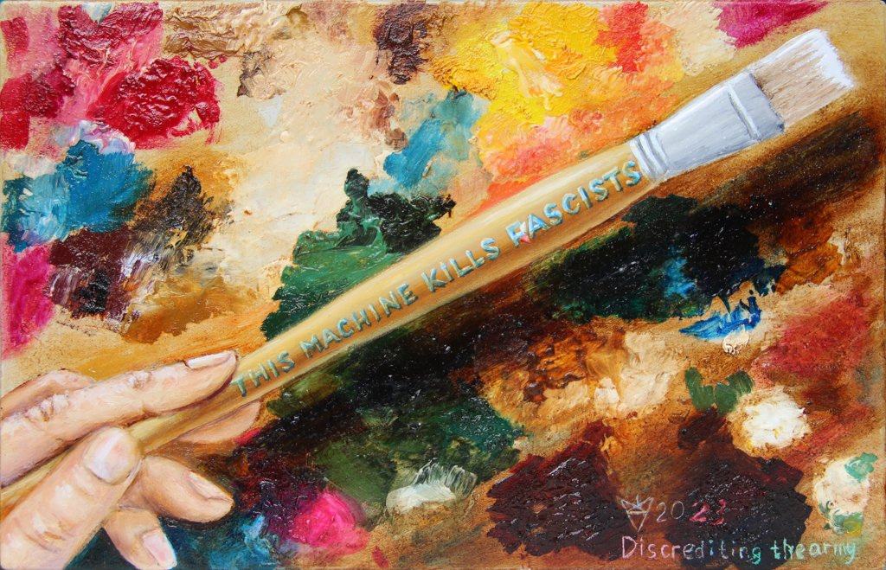

# Anti-war artworks

## Terminal Decay

https://declassed.art/en/gallery/terminal-decay

2023-03-25 Oil on MDF, 13x10.4 in (33x26.5 cm)

As I see it, Russian patriots have reached the terminal decay, buying Shahed drones from Iran, renaming them to Geranium and with a thought To Berlin! killing other slavs.

Another allusion is Flowerthrower, well, you know.

## The Sacred Pipeline

https://declassed.art/en/gallery/the-sacred-pipeline

2023-03-03 (2022-2023) Oil on Canvas, 19.7x31.5 in (50x80 cm)

When I started it in April 2022 my thought was "No matter how many more people they will kill, they won't touch the pipeline."
Although Biden (as they say) had balls to break the nordic one, that little filth do not relate to the main subject,
where money laundering is the priority. Well, as I see it.

Anyway, nothing has changed over the last year and the pipeline is still sacred platinum sponsor of UA:RU deathmatch.
Slavs kill slavs, exactly as Maggie wanted. But given the 25K population target and the current progress, it's for a long time.
Alas.

## Discrediting The Army

https://declassed.art/en/gallery/discrediting-the-army

2023-03-31 Oil on MDF, 13x8.5 in (33x21.5 cm)

